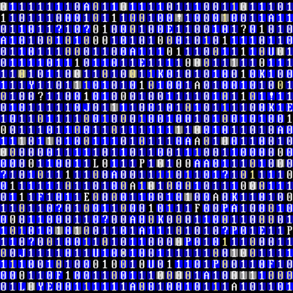

# 
< Welcome />! 

  

  

  

---

<h3 align="center"> Let's Connect:</h3>

---

<h3 align="center">Languages and Tools:</h3>

  
  

---

  
  

    
 

<table>
  <tr>
    <td>
      
    </td>
    <td>
      
    </td>
  
  </tr>
</table>

